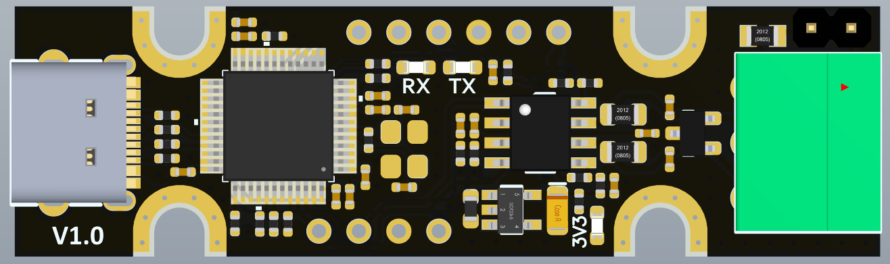

# UCAN

UCAN is an open source USB-to-CAN interface board, based on STM32F072 and candleLight open source firmware, and supports linux/win/mac multi-platform.

# Feature

- Supports CAN2.0A and B, baud rates up to 1M
- Compatible with candleLigtht V1 hardware pin assignment
- Native socketcan support with candleLight firmware
- 3-pin screw plug terminal: CANH, CANL,  GND
- Headers to enter bootloader for firmware updates and SWD interface
- Headers to CAN interface before transceiver
- Headers to enable/disable termination，On-board termination resistors（2 x 59R） are used by default
